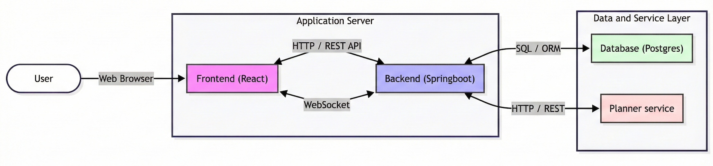

# E-Gradebook System with Timetable Generator

## 📖 About the Project

This project presents a modern e-gradebook system designed to address the lack of automatic timetable generation in current market solutions. It utilizes a client-server architecture with a dedicated scheduling microservice.

A distinct feature of this system is the **"Planner Service"**—a Python-based module utilizing **Google OR-Tools** and **CP-SAT**. It applies Constraint Programming to generate optimal schedules, respecting teacher availability and avoiding gaps in student timetables.

### Key Features:

* **Automatic Timetable Generation** (Constraint Programming).
* Management of users, grades, and attendance.
* Handling of substitutions.
* Real-time chat (WebSockets).
* Full application containerization.

## 🏗️ System Architecture

The diagram below illustrates the data flow and communication between the Frontend, Backend (Spring Boot), and the Planner Service (Python).



## 🛠️ Technologies

The system relies on a modern tech stack to ensure performance and reactivity:

**Backend:**

* Java, Spring Boot
* Reactive Stack: WebFlux, R2DBC
* Database: PostgreSQL

**Frontend:**

* React
* WebSockets (for real-time interaction)

**Scheduler (Planner Service):**

* Python
* Google OR-Tools (CP-SAT solver)

**Infrastructure:**

* Docker & Docker Compose

## 🚀 How to Run

The application is fully containerized. To run the entire system (database, backend, frontend, planner service), ensure you have **Docker** and **Docker Compose** installed, then execute the following command in the project root:

```shell
docker-compose up --build
```

The build process may take a few minutes during the first run.

## 🌐 Application Access

Once the containers are successfully running, the client application is available at:

**Frontend:** `http://localhost:3000`

### 🔑 Default Administrator Account

An administrator account with full permissions is automatically added to the system. Use the credentials below to log in:

* **Email:** `admin@gmail.com`
* **Password:** `admin`

## ⚙️ Configuration (.env)

The project includes a pre-configured environment file for development. Below are the key variables used in the `docker-compose` configuration:

```ini
# Database
DB_NAME=gradebookdb
DB_USER=gradebookuser
DB_PASSWORD=gradebookpassword

# JWT Security
JWT_SECRET=0cc658320e195c8c79afd07b00b8049acf3221405a50ffaba145d98dfdc0a9a2f0a1de97
JWT_EXPIRATION=900000
JWT_REFRESH_EXPIRATION=604800000

# Inter-service Communication
SOLVER_API_KEY=xkbUAZgRO3gWc+sJVZwc2SrZdn2XOo3gI2IWdqXYLgw=
GRADEBOOK_API_KEY=xkbUAZgRO3gWc+sJVZwc2SrZdn2XOo3gI2IWdqXYLgw=
WORKERS=12
```